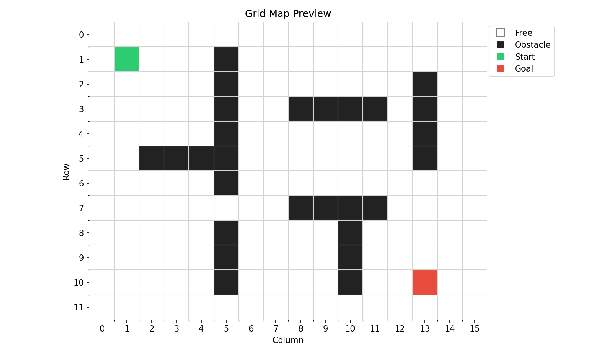
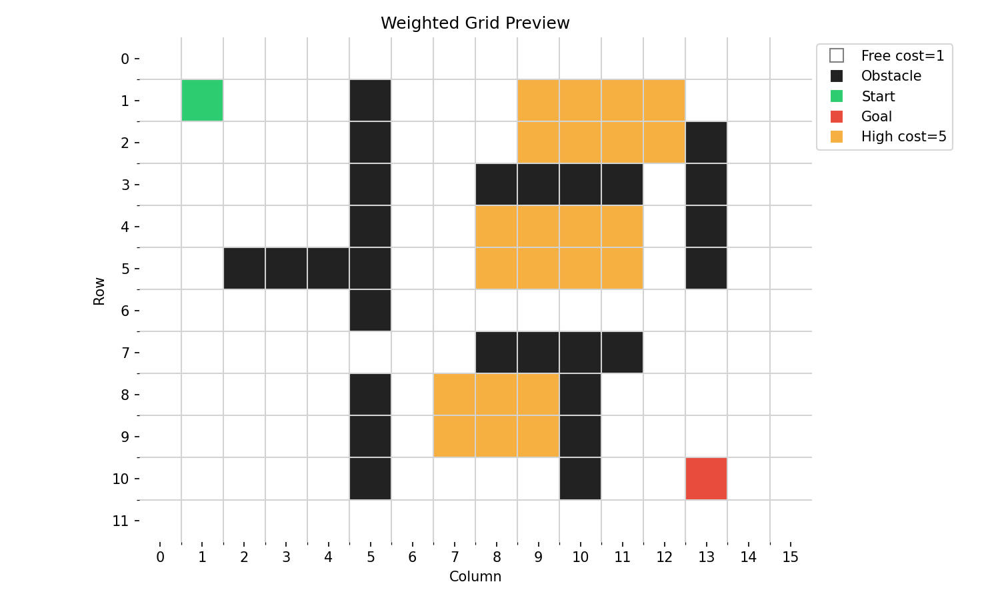
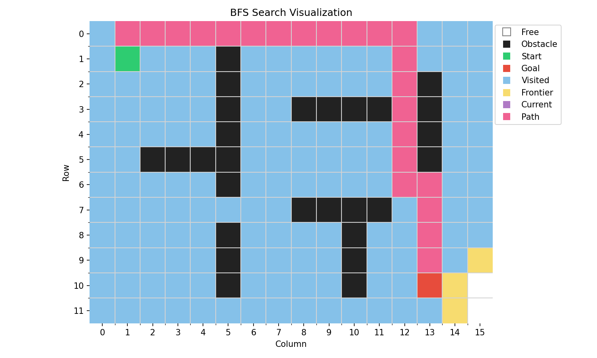
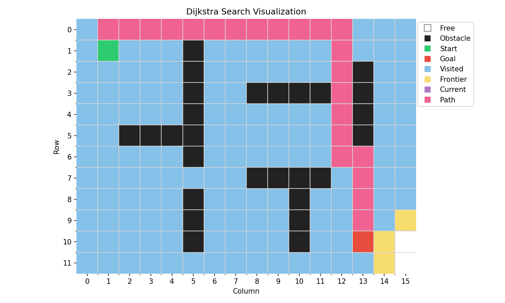
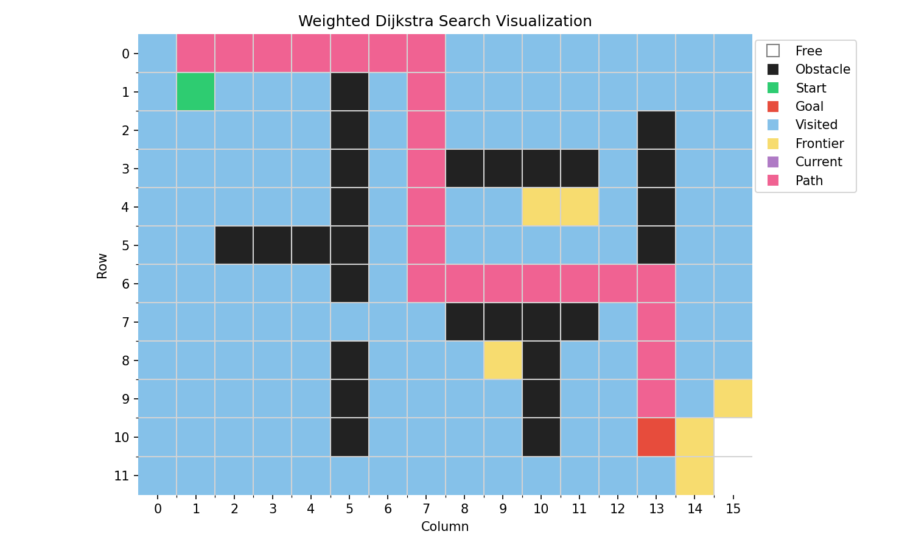
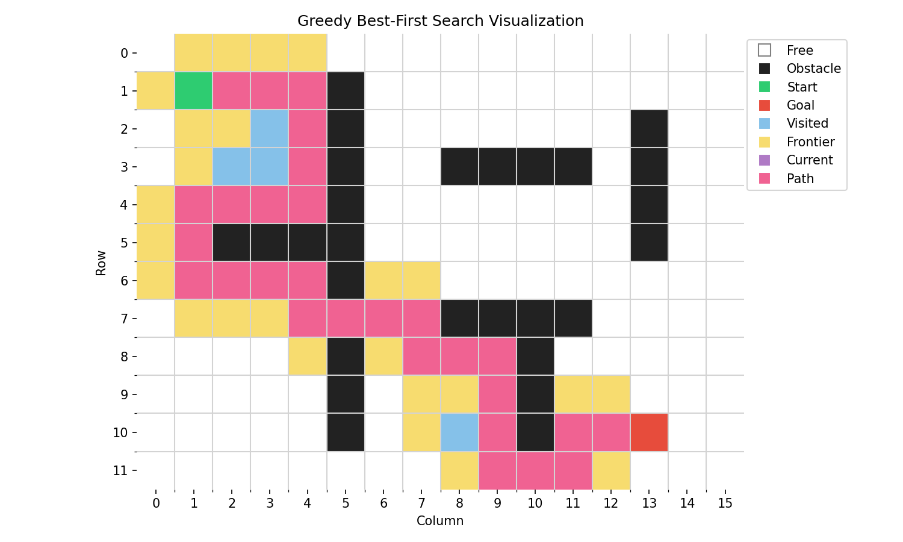
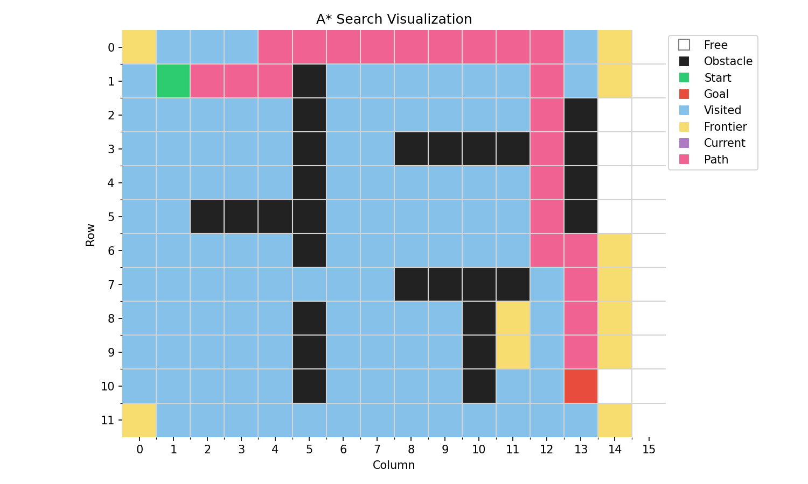
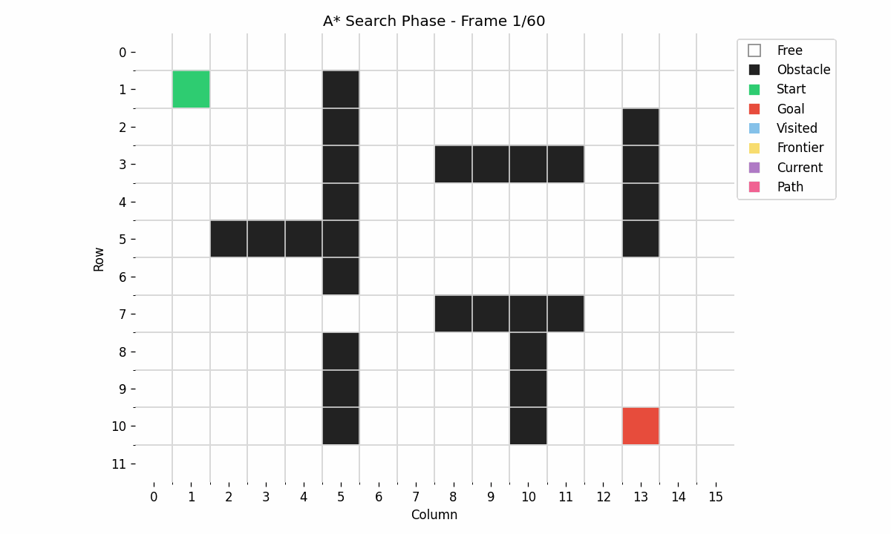

# Robot Path Planning Visualizer

A visual robotics-oriented path planning project that shows how search algorithms explore a grid map and find a path from a start cell to a goal cell.

The main goal is not only to compute the final path, but also to make the search process visible step by step.

## Demo

### Grid Map

### Weighted Grid Cost Map

### BFS Search Result

### BFS Search Animation

### Dijkstra Search Result

### Dijkstra Search Animation

### Weighted Dijkstra Search Result

### Weighted Dijkstra Search Animation

### Greedy Best-First Search Result

### Greedy Best-First Search Animation

### A* Search Result

### A* Search Animation

## Current Status

The project currently includes:

- a demo grid map with obstacles, start, and goal cells
- a weighted grid cost map
- Breadth-First Search implementation
- Dijkstra Search implementation
- weighted Dijkstra Search implementation
- Greedy Best-First Search implementation
- A* Search implementation
- search-state tracking for implemented algorithms
- static visualizations of search results
- animated GIFs showing the exploration process
- path reconstruction visualization after the goal is found
- algorithm comparison metrics using weighted path cost

## Implemented Algorithms

### Breadth-First Search

BFS explores the grid level by level from the start cell.

It treats every valid move as having the same cost, so it is useful as an unweighted baseline.

### Dijkstra Search

Dijkstra explores the grid based on the current shortest known path cost.

On a uniform-cost grid, its final path can look similar to BFS. On a weighted grid, Dijkstra can prefer a lower-cost path even if the route is not visually the most direct one.

### Weighted Dijkstra Search

The weighted version uses a cost map where some cells are more expensive to cross.

This makes the difference between shortest path and lowest-cost path more visible.

### Greedy Best-First Search

Greedy Best-First Search uses a heuristic to move toward the goal.

It can explore fewer cells than BFS, but it does not guarantee the lowest-cost or shortest path because it focuses mainly on estimated closeness to the goal.

### A* Search

A* combines the cost already traveled with a heuristic estimate to the goal.

It is more informed than BFS and Dijkstra on an unweighted grid, and more balanced than Greedy Best-First Search.

## Algorithm Comparison

The project also generates a CSV file with comparison metrics:

`results/algorithm_comparison.csv`

Current comparison result:

| Algorithm | Path length | Weighted path cost | Visited cells | Search steps |
|---|---:|---:|---:|---:|
| BFS | 24 | 31 | 163 | 161 |
| Dijkstra | 24 | 31 | 160 | 161 |
| Weighted Dijkstra | 24 | 23 | 157 | 158 |
| Greedy Best-First | 30 | 45 | 34 | 35 |
| A* | 24 | 31 | 137 | 138 |

The comparison shows that Greedy Best-First explores fewer cells, but produces a higher-cost path. Weighted Dijkstra gives the lowest weighted path cost on the current cost map.

## Planned Improvements

- weighted A* Search
- side-by-side algorithm comparison
- comparison charts for visited cells, path cost, and search steps
- cleaner shared visualization utilities
- optional interactive version

## Visual Features

The visualizer uses different cell states for:

- free cells
- obstacle cells
- high-cost cells
- start cell
- goal cell
- visited cells
- frontier cells
- current cell
- final path cells

## Portfolio Context

This project supports my broader portfolio direction in intelligent physical systems, robotics, and autonomous systems.

It complements projects in:

- sensor fusion and state estimation
- embedded sensing
- feedback control
- intelligent monitoring systems

In a robotics pipeline, state estimation helps a robot understand where it is, path planning helps it decide where to go, and control helps it follow the planned path.

## Repository Structure

robot-path-planning-visualizer/
├── docs/
├── results/
│   ├── grid_preview.png
│   ├── weighted_grid_preview.png
│   ├── bfs_search_preview.png
│   ├── bfs_search.gif
│   ├── dijkstra_search_preview.png
│   ├── dijkstra_search.gif
│   ├── weighted_dijkstra_search_preview.png
│   ├── weighted_dijkstra_search.gif
│   ├── greedy_search_preview.png
│   ├── greedy_search.gif
│   ├── astar_search_preview.png
│   ├── astar_search.gif
│   └── algorithm_comparison.csv
├── src/
│   ├── grid_map.py
│   ├── weighted_grid.py
│   ├── preview_grid.py
│   ├── preview_weighted_grid.py
│   ├── search_algorithms.py
│   ├── compare_algorithms.py
│   ├── run_bfs_demo.py
│   ├── run_bfs_animation.py
│   ├── run_dijkstra_demo.py
│   ├── run_dijkstra_animation.py
│   ├── run_weighted_dijkstra_demo.py
│   ├── run_weighted_dijkstra_animation.py
│   ├── run_greedy_demo.py
│   ├── run_greedy_animation.py
│   ├── run_astar_demo.py
│   └── run_astar_animation.py
├── .gitignore
├── README.md
└── requirements.txt

## How to Run

Create or activate a Python virtual environment, then install the required packages:

pip install -r requirements.txt

Generate the initial grid preview:

python src/preview_grid.py

Generate the weighted grid preview:

python src/preview_weighted_grid.py

Generate BFS outputs:

python src/run_bfs_demo.py
python src/run_bfs_animation.py

Generate Dijkstra outputs:

python src/run_dijkstra_demo.py
python src/run_dijkstra_animation.py

Generate weighted Dijkstra outputs:

python src/run_weighted_dijkstra_demo.py
python src/run_weighted_dijkstra_animation.py

Generate Greedy Best-First outputs:

python src/run_greedy_demo.py
python src/run_greedy_animation.py

Generate A* outputs:

python src/run_astar_demo.py
python src/run_astar_animation.py

Generate algorithm comparison metrics:

python src/compare_algorithms.py
